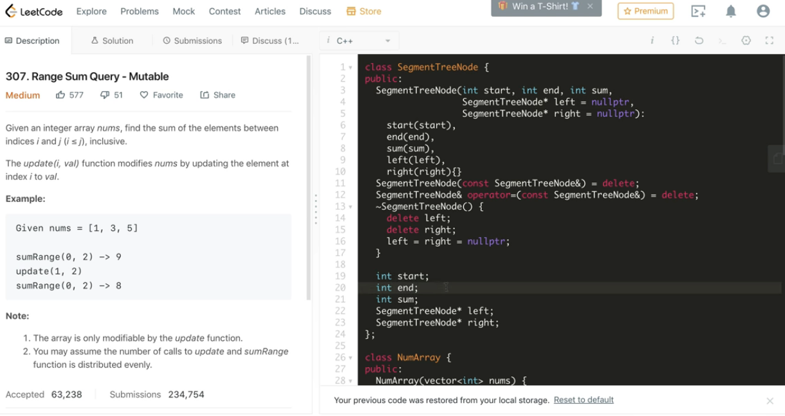

线段树是一种二叉搜索树，与区间树相似，它将一个区间划分成一些单元区间，每个单元区间对应线段树中的一个叶结点。
对于线段树中的每一个非叶子节点[a,b]，它的左儿子表示的区间为[a,(a+b)/2]，右儿子表示的区间为[(a+b)/2+1,b]。
因此线段树是平衡二叉树，最后的子节点数目为N，即整个线段区间的长度。

使用线段树可以快速的查找某一个节点在若干条线段中出现的次数，时间复杂度为O(logN)。
而未优化的空间复杂度为2N，因此有时需要离散化让空间压缩。

